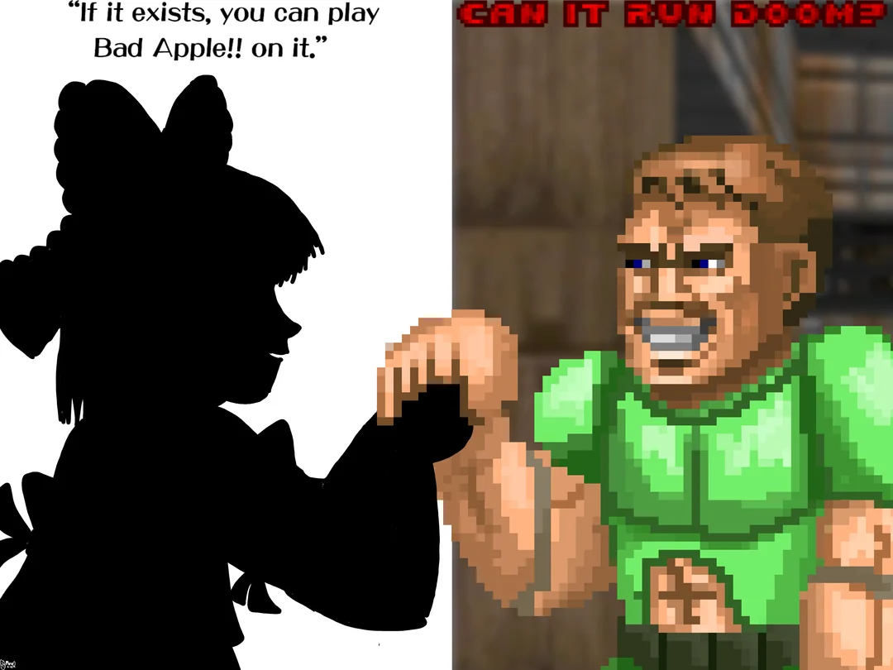
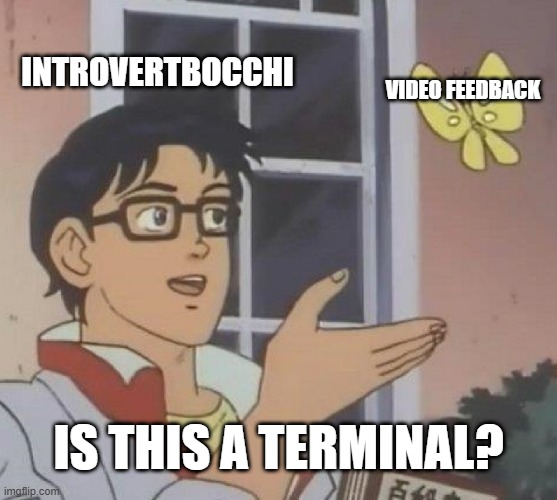
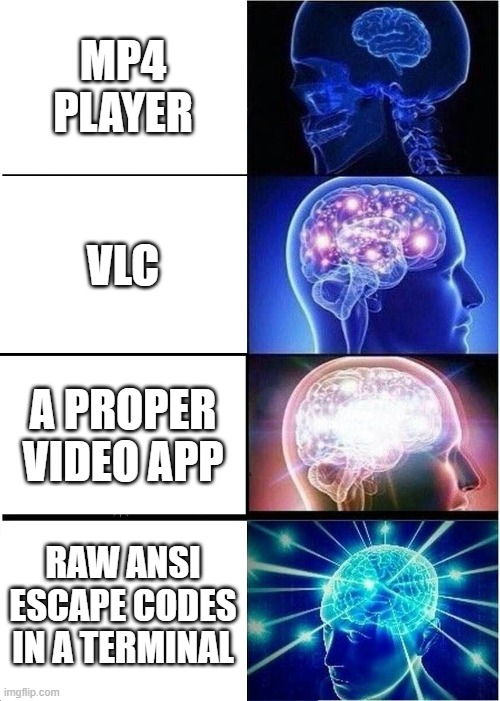
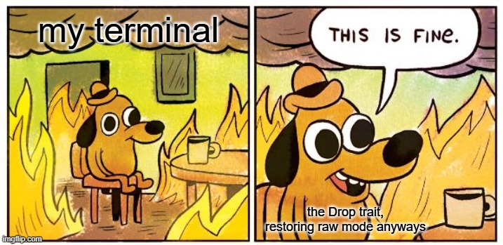
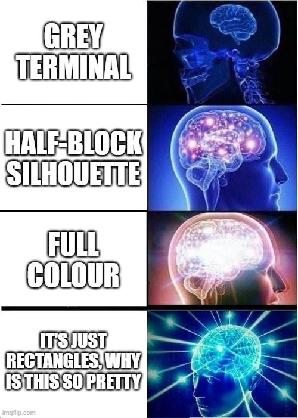
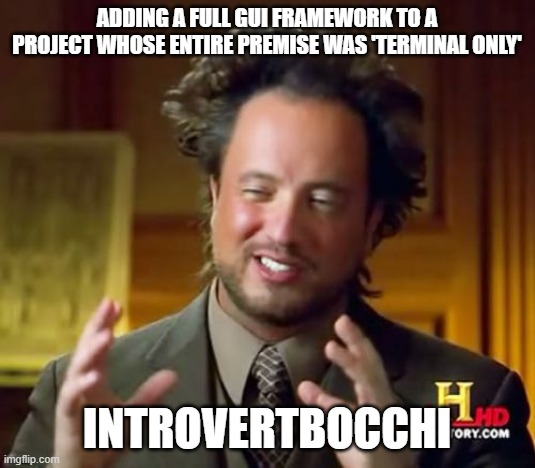

# Bad Apple!! ▀▄ — Terminal Video Player



> *"Does your terminal play music videos in 30fps black-and-white Unicode blocks, synced to audio, with zero GUI?"*
> No? Couldn't be me.

A Rust program that plays video entirely inside a terminal window — synced audio, zero GUI, zero shame. Started as a Bad Apple!! player rendering ▀ half-block silhouettes. Now plays basically anything — Initial D, Bocchi the Rock!, whatever you've got — in your choice of black-and-white silhouette or full 24-bit colour, at your choice of four escalating levels of Unicode block resolution (half, quad, sextant, octant), because apparently one working version was never going to be enough.



---

## Wait, How Is This Even Possible?

*(For anyone who just watched a full-colour video play inside a black CMD window and needs a second to process that.)*

Terminals have technically been able to display real colour for years — programmers just mostly never pointed that ability at anything except plain text. This project basically hijacks it.

Here's the trick: every tiny square on a terminal screen is normally reserved for one letter. But nothing's stopping you from telling that square "don't show a letter — just *be* this exact colour" instead. Do that to thousands of tiny squares, all at once, 30 times a second, in sync with the audio, and your eye stops seeing "a grid of coloured squares" and starts reading it as a moving picture — the same way a TV is secretly just a grid of tiny coloured dots too.

Think of it like paint-by-numbers, but the "canvas" is a typewriter, and the typewriter can also change colour and is doing it fast enough to look smooth. There's no video player involved anywhere in this. No window, no player app, nothing designed for this. That's kind of the whole point.

And here's the part worth sitting with for a second: **CMD is one of the oldest, plainest pieces of software still shipping on modern computers.** It was never built for graphics, animation, or anything remotely like this — it was built to show you file listings. Getting it to play a full-colour, audio-synced music video isn't a feature anyone added; it's a byproduct of the fact that "change this square's colour" was always technically *possible*, just never really *used*. This project didn't find a shortcut — it just took a 40-year-old tool completely seriously and pushed it somewhere it was never supposed to go. That's the whole appeal, really: not that it's clever, but that it's using the oldest, most boring window on your computer to do something it was never designed to do, at all.

---

## Why

Because "Bad Apple runs on X" is basically a rite of passage at this point, and terminals were sitting right there. This was a personal learning project with exactly one goal: **get Rust working on something visual, real-time, and synced to audio** — no client, no deadline, no scope creep (mostly).

---

## What It Actually Does

- Decodes any video FFmpeg can read, frame-by-frame, as a subprocess
- Resizes and converts each frame to greyscale
- Automatically picks the best black/white split point per scene using **Otsu's method** — no hardcoded threshold, adapts on its own to whatever you throw at it
- Optional **Floyd–Steinberg dithering** for busy, colourful, gradient-heavy footage — turns midtone detail into recognisable halftone texture instead of flattening it into blobs. Swap between plain-threshold and dithered rendering with a command-line flag, no recompiling
- Renders every frame as `▀` half-block characters, two vertical pixels packed into one character cell using foreground + background ANSI colours
- Plays the audio track on its own thread, completely independent of rendering
- Keeps video perfectly in sync with audio, dropping frames if it falls behind rather than letting the audio drift
- Cleans up after itself — always. Raw mode disabled, cursor restored, screen cleared — whether the video ends naturally, you smash Q, or the program straight-up panics



---

## Tech Stack

| Piece | Crate | Job |
|---|---|---|
| Language | Rust | Because we like pain, apparently |
| Video decoding | [`ffmpeg-sidecar`](https://crates.io/crates/ffmpeg-sidecar) | Spawns real FFmpeg as a subprocess, streams raw RGB frames back over a pipe — no bindgen, no linking against FFmpeg's C libs |
| Audio playback | [`rodio`](https://crates.io/crates/rodio) | Decodes and plays audio on a background thread, independent of rendering |
| Terminal control | [`crossterm`](https://crates.io/crates/crossterm) | Raw mode, cursor control, ANSI colour codes, non-blocking key input |
| Image processing | [`image`](https://crates.io/crates/image) | Lanczos3 resizing + greyscale conversion, frame by frame |
| Timing | `std::time` | Tracks elapsed playback time against each frame's real timestamp, sleeps or drops frames to stay in sync |

---

## How It Works (the short version)

1. **FFmpeg** decodes the video and hands raw RGB frames to Rust over a pipe.
2. Each frame gets **resized** to fit the terminal (with double the vertical resolution, since two pixels = one character cell) and converted to **greyscale**.
3. Every few frames, **Otsu's method** looks at that frame's brightness histogram and picks the cutoff point that best splits it into "dark" and "light" — recomputed periodically rather than every frame, since it's real work and scenes don't change their lighting instantly.
4. Depending on which mode you launch with, each pixel pair either gets hard-thresholded against that cutoff, or run through **Floyd–Steinberg dithering** — diffusing each pixel's rounding error onto its neighbours so gradients survive as halftone-style texture instead of vanishing. Either way, the result gets printed as a `▀` character — background colour for the top pixel, foreground colour for the bottom.
5. **Audio** starts on its own thread the moment playback begins.
6. The render loop checks each frame's real timestamp against elapsed wall-clock time — sleeping if it's ahead, skipping the frame entirely if it's fallen too far behind.
7. Press `Q` any time to quit. However you leave — Q, natural end, or a crash — a guard struct restores your terminal to normal on the way out, guaranteed.



---

## Build Log (a.k.a. Deliverables)

Each of these was built and fully tested before the next one started. No skipping ahead, no "I'll fix it later."

- [x] **01 — Project Setup + FFmpeg Frame Decoding** — proved FFmpeg spawning and frame reading works before touching anything else
- [x] **02 — Frame Conversion** — resize + greyscale pipeline, proven on a single frame
- [x] **03 — Unicode Block Rendering** — first frame rendered as actual block characters; mostly solid black because Bad Apple opens on a black screen, and yes that's correct
- [x] **04 — Audio Playback** — rodio proven in isolation, no video, just confirming sound comes out of the speakers
- [x] **05 — Synchronised Playback Loop** — the real deal: video and audio running concurrently, frame-drop logic keeping them locked together
- [x] **06 — Terminal Cleanup + Polish** — raw mode, cursor, and screen state restored on every exit path, panic-safe, via a `Drop`-based guard struct
- [x] **07 — Adaptive Silhouette Rendering (Otsu's Method)** — killed the hardcoded `128` threshold; now computes the optimal black/white split per scene from each frame's own brightness histogram, throttled to every 5th frame to keep it cheap. This is what unlocked playing videos that aren't Bad Apple in the first place
- [x] **08 — Floyd–Steinberg Dithering** — optional mode that diffuses per-pixel rounding error onto neighbouring pixels instead of hard-cutting, so gradient-heavy footage reads as texture instead of flat blobs. Toggle with `otsu` / `dither` on the command line

---

## Known Quirks

- **It's 30fps, not 60.** Checked with `ffprobe` directly against the source file — it's genuinely encoded at 30fps. This isn't a bug, it's just what the source material is. Frame interpolation could get you smoother motion, but that's a real feature addition, not a fix, and it's intentionally out of scope for now.
- That weird grey highlighted bar you might see after the program exits in some terminals (looking at you, VS Code + PowerShell) — that's your shell's own inline command-suggestion UI, not us. We tested it: happens after literally any command.
- Otsu recomputes every 5th frame, not every frame, to keep pacing up on busier/higher-resolution footage — you're seeing a slightly-throttled adaptive threshold, not a live one, and it's imperceptible in practice.
- **It might just freeze mid-video sometimes.** Not crash, not error out — just... stop, for a beat, then continue. This appears to be hardware-dependent, and "hardware-dependent" is doing a lot of work in that sentence, because it was tested on a machine that is not exactly struggling:

  > AMD Ryzen 5 7535HS w/ Radeon Graphics, 3301 MHz, 6 Cores / 12 Logical Processors · 16.0 GB RAM · AMD Radeon(TM) Graphics + NVIDIA GeForce RTX 4050 Laptop GPU

  A laptop with a discrete RTX 4050 in it, occasionally getting winded rendering **black and white rectangles in a terminal**, is a genuinely funny sentence to have to type in a README. We don't have a root cause yet beyond "real-time ANSI escape codes plus per-pixel float math is apparently more than it looks like." If it happens to you too: it's not just you. If it *doesn't* happen to you, please don't tell us, let us have this.

- **Why dither mode looks smoother than Otsu mode, and why Otsu mode is the one that stutters.** These two techniques are doing genuinely different jobs, and it shows:

  **Otsu's method** picks *one* black/white cutoff for the *whole frame*, based on that frame's brightness histogram, recomputed every 5th frame to keep it affordable. That's a full pixel scan plus a 256-step search — real, chunky, occasional work. When it fires (every 5th frame), that frame briefly does noticeably more math than its neighbours. Most of the time that's invisible, but it's the most likely candidate for those "hitch, then continue" freezes above — a burst of histogram-and-search work landing right as the render loop is also trying to keep pace with a tight frame budget, especially on higher-resolution or busier footage. It's also why the very first frame can feel a beat slower to appear — the very first Otsu computation happens cold, before the loop has any rhythm to fall back on.

  **Floyd–Steinberg dithering**, once it has a threshold to work from (courtesy of Otsu, since the two work together, not against each other), does *consistent, evenly-distributed* per-pixel work — same cost every single frame, no periodic spikes, nothing bursty. That consistency is exactly why it *feels* smoother even though it's arguably doing more total math over time: predictable per-frame cost is easier for a real-time loop to absorb than an occasional lumpy one. It also just plain preserves more of the source image — diffusing rounding error instead of hard-cutting it means gradients and midtones survive as texture instead of getting flattened, so dithered output tends to look closer to "the actual video, but monochrome" rather than "a shape that's approximately the video."

  Short version: Otsu decides *where* the line is, occasionally, in bursts. Dithering decides *how* to live with that line, constantly, smoothly. One is a sprinter, one is a jogger, and the jogger looks better on camera.

- **Why colour mode can look like it's "vibrating" on faces even though the motion itself is buttery smooth.** These are two completely separate systems, and it really shows once you notice it:

  Motion smoothness is handled entirely by the sync loop — it's comparing real timestamps against real elapsed time, 30 times a second, and it doesn't care what's *inside* a frame at all. That part's rock solid regardless of mode.

  The vibrating texture is a different problem entirely, and it's specific to quad/sextant/octant colour mode's clustering trick. Every character cell independently decides, fresh, from scratch, every single frame, which of its handful of sample pixels count as "the light half" versus "the dark half" of that one tiny block — with zero memory of what it decided one frame ago. On a flat-coloured background that's a stable, easy call every time. But a face has *subtle*, closely-bunched shading — pixels that are almost, but not quite, the same brightness, sitting right on the edge of that block's own light/dark split. Real video has a small amount of natural frame-to-frame noise (compression artifacts, tiny lighting shifts) even when nothing's actually moving — and that's enough to occasionally nudge one of those borderline pixels across the line, flipping which group it lands in. When that happens, the cell's foreground/background colour shifts slightly, for exactly one frame, then flips back. Do that across dozens of borderline cells on a face, 30 times a second, and it reads as a shimmer or vibration — even though the face itself hasn't moved an inch.

  It's the same root cause as dithering's "controlled scribble," just happening in *time* instead of *space* — noise nudging borderline pixels back and forth, except here it's frame-to-frame instead of pixel-to-pixel. Nothing's broken; the motion you're tracking is smooth because that's a completely different, unrelated system doing its job correctly. It's specifically fine-detail *texture* that's a little jittery, and it's most visible exactly where you'd expect — skin, soft shading, anywhere the source image doesn't hand each block a clean, confident answer.

---

## The Curious Case of *Rick Astley* in Explaining Otsu and Floyd–Steinberg Dithering


Forget the code for a second. Imagine you've got a music video — let's say, purely hypothetically, [a certain 1987 song](https://www.youtube.com/watch?v=dQw4w9WgXcQ) — and your only art supplies are a black marker and a white piece of paper. No grey. No shading. You have to redraw every single frame of Rick Astley using only solid black and solid white shapes, fast enough to keep up with the song. That's the entire challenge our program is solving, 30 times a second.

There are two ways to approach this, and they're the two modes you can switch between:

**Otsu mode is the "one confident decision" artist.** Before drawing each new frame, it looks at the whole picture — Rick's face, the background, his coat — and picks *one* brightness rule for that whole frame: "anything darker than this shade becomes black, anything lighter becomes white." Then it commits, hard, no exceptions. Simple, fast, decisive. The catch: figuring out the *right* rule means stopping to actually study the whole frame's brightness first — like an artist pausing mid-sketch to squint at the reference photo and think "hang on, what's the right cutoff here?" Do that calculation often enough on a busy, detailed frame, and the artist occasionally freezes for a beat before their pen moves again. That pause is your "startup delay" and those occasional mid-video freezes — Otsu doing its one big think before it draws.

**Dithering mode is the "controlled scribble" artist.** Instead of one confident rule for the whole frame, it makes a call on a single pixel, notices exactly how wrong that call was, and immediately smudges that leftover error onto the pixels right next door — nudging them to quietly make up for it. It never stops to think about the big picture; it's constantly, evenly correcting itself pixel by pixel as it goes. That means no big pauses to "figure out the frame" — just steady, predictable work the whole way through, which is exactly why it feels so much smoother in practice. And because it's compensating instead of flattening, Rick's face keeps its shading, his jacket keeps its folds, the lighting keeps its gradient — the drawing ends up looking like an actual halftone photo of Rick Astley, not just a black Rick-shaped blob. It's not "cheating" by using more colours — it's cleverly arranging only black and white so your eye *perceives* grey that was never really there.

**Fun fact: you've already seen both of these tricks used on real footage of real Rick Astley, and everyone else, your whole life.**
- **Otsu's method** is the same "pick one clean cutoff line" logic your bank's check-deposit app uses to turn a photo of a check into crisp black text on white paper, and the same trick document scanners use to clean up a scanned page. Somewhere, that exact algorithm is helping a scanner read a receipt while also, in this repo, deciding where Rick Astley's jawline is.
- **Floyd–Steinberg dithering** is the actual, literal technique behind why old black-and-white newspaper photos look like they have real shading and depth despite only using ink dots, why 90s-web GIFs could fake so many more colours than they actually had, and why old e-ink Kindles can show you a full-colour photo convincingly in greyscale. If you've ever squinted at a grainy old newspaper photo and gone "huh, that kind of looks like a real photo" — that's this. That's the whole trick.

So yes: this project is, underneath the terminal blocks and the memes, quietly running the same math that powers mobile check deposits and 1980s newspaper printing, in service of watching a man get rickrolled in ANSI.

---

## Why We Added Colour (A Confession)

Let's be honest about what happened here. The entire *premise* of this project — the whole bit — was "black and white silhouette, on brand for Bad Apple, terminal purity, no cheating." That was a real design decision, written down, with reasons. And then one day the question became "hey, since we can already play *any* video now… could it also just… have colour?"

The correct answer was "no, that defeats the entire aesthetic." The actual answer was "let's find out."

So: full 24-bit truecolor rendering, straight through the same half-block terminal trick, no compromises. Why? Because it looks **cooler**, obviously. Somewhere between "get Rust to draw video in a terminal" and "personally clock how many milliseconds it costs PowerShell's console host to paint an RGB escape code," this project quietly stopped being about Bad Apple and became about **how far the bit could go before physics said no.** That's not scope creep, that's scope *sprint*. There's a difference. We're choosing to believe there's a difference.



## The Resolution Arms Race: Half → Quad → Sextant → Octant

Once colour was in, "blocky" suddenly became very visible in a way it never was in black-and-white mode — a silhouette can get away with jagged edges; a face gradient cannot. So naturally, the only sane response was to escalate the actual pixel density per character cell four separate times, each one chasing diminishing returns a little further down a hole that Unicode itself only recently finished digging.

| Style | Pixels per cell | What it actually buys you |
|---|---|---|
| **Half-block** `▀` | 1×2 | Where we started. Good enough for Bad Apple. Not good enough once we let colour in the building. |
| **Quadrant** `▘▝▖▗` etc. | 2×2 | Doubled horizontal detail. Character faces stop looking like Minecraft. Foreground/background now has to average a *cluster* of real pixels instead of just reading one — the first hint we were trading colour fidelity for shape. |
| **Sextant** `🬀🬁🬂` etc. | 2×3 | A genuinely new-ish Unicode block (2020), meaning older terminals may just render `▯` boxes at you. Six real pixels crammed into 2 output colours. Getting sharper, getting harder to keep colour-honest. |
| **Octant** `𜴀𜴁𜴂` etc. | 2×4 | The actual ceiling — went and checked, Unicode does not go higher than this for solid block glyphs. Eight real source pixels, still only 2 colours to represent them with. Sharpest shapes we can draw. Also the blurriest colour averaging of the bunch, because you can't have both — we checked that too. |

The honest pattern, if you follow the table down: **shape detail keeps going up, colour accuracy keeps going down**, every single step. That's not a bug in any one of them — it's the actual, unavoidable tradeoff of representing more real pixels using the same fixed 2-colours-per-cell terminal budget. Half-block colour mode is the most colour-faithful and the blockiest. Octant colour mode is the sharpest silhouette and the most colour-approximated. Nothing in between is free — you're just choosing which axis to be a little bit wrong on.

For black-and-white Otsu/Dither modes, none of this tradeoff exists — there's no colour to blur, so sextant and octant are just straightforwardly, unambiguously sharper with zero downside. Colour mode is the only place this whole table has actual opinions.


---

## Explicitly *Not* Included

Because scope creep is how side projects die:

- True background/foreground segmentation or ML-based subject isolation — Otsu + dithering get you a good silhouette, not a rotoscoped one
- Anything past octant resolution — that's the actual Unicode ceiling for solid block glyphs, there is nowhere higher to go
- Frame interpolation for smoother-than-source motion
- Playback controls beyond "Q to quit"
- A GUI, a window, or anything resembling one
- Audio visualisation
- Recording / export functionality



---

## Running It

```bash
cargo run --release -- "path/to/video.mp4" "path/to/audio.wav" [otsu|dither]
```

The third argument is optional and defaults to `dither`. Use `otsu` for a clean flat-threshold silhouette (best on already-high-contrast footage like Bad Apple), or `dither` for busier, gradient-heavy footage where you want texture and detail to survive (Initial D, Bocchi the Rock!, anything with actual lighting in it).

```bash
# Clean silhouette mode
cargo run --release -- "path/to/bad apple.mp4" "path/to/bad apple.wav" otsu

# Dithered halftone mode
cargo run --release -- "path/to/initial_d_opening.mp4" "path/to/initial_d_opening.wav" dither
```

> Note: audio needs to be a separately extracted WAV file — see build notes for the ffmpeg extraction command used.

Press `Q` at any time to quit. Resize your terminal before launching for a bigger/smaller render — it adapts to whatever size you've got.

> ## ⚠️ DO NOT FORGET `--release`. I AM BEGGING YOU.
>
> This is not a stylistic preference. This is a documented, tested, measured warning.
>
> Run this thing in plain `cargo run` (debug mode) against anything busier than Bad Apple and Otsu + dithering — both of which do real per-pixel math, every frame — will get crushed by the lack of compiler optimizations. We measured it. **96.4% of frames dropped.** Not "a bit choppy." Not "slightly less smooth." A borderline slideshow, playing back audio synced to a video that is, for all practical purposes, buffering forever.
>
> Do this inside the **VS Code integrated terminal** specifically and you are now asking an Electron app to eat a real-time ANSI escape-code firehose it was never built for, at the exact moment your CPU is already maxed out doing unoptimized floating-point error diffusion 30-60 times a second. VS Code *will* start chugging. Your fans *will* spin up like a jet engine. Unsaved work is a real risk here — save your files first, this isn't a joke.
>
> `--release` isn't an optional performance nice-to-have. It's the difference between "smooth terminal silhouette playback" and "why is my IDE not responding." You have been warned. 🫡🔥

> ## 💀 ALSO: DO NOT RUN VIDEOS BACK-TO-BACK IN THE SAME VS CODE TERMINAL
>
> Genuinely, actually, no exaggeration: playing one video, letting it finish or quitting with `Q`, and then immediately running another one **in that same terminal tab** has a real chance of taking the whole VS Code window down with it. Not "the program" — VS Code itself. The editor. Your open files. Everything.
>
> Our best guess is that it's some combination of the terminal's ANSI/scrollback buffer already being under strain from the first run, plus raw mode getting re-enabled on top of a terminal that hasn't fully settled, plus VS Code's terminal being an Electron-rendered thing pretending to be a real terminal emulator, all getting asked to do it again before it's caught its breath. We haven't root-caused it further than that, and honestly we're a little afraid to.
>
> **The fix is stupidly simple: open a new terminal tab (or a native terminal window, not VS Code's) for each run.** That's it. That's the whole workaround. Costs you two clicks, saves your editor's life.
>
> Ask us how we know. Actually don't. We'd rather not relive it.

---

*A personal build. No client sign-off required. Deliberately over-engineered for something that renders in 30 shades of "off."*
